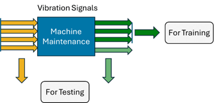
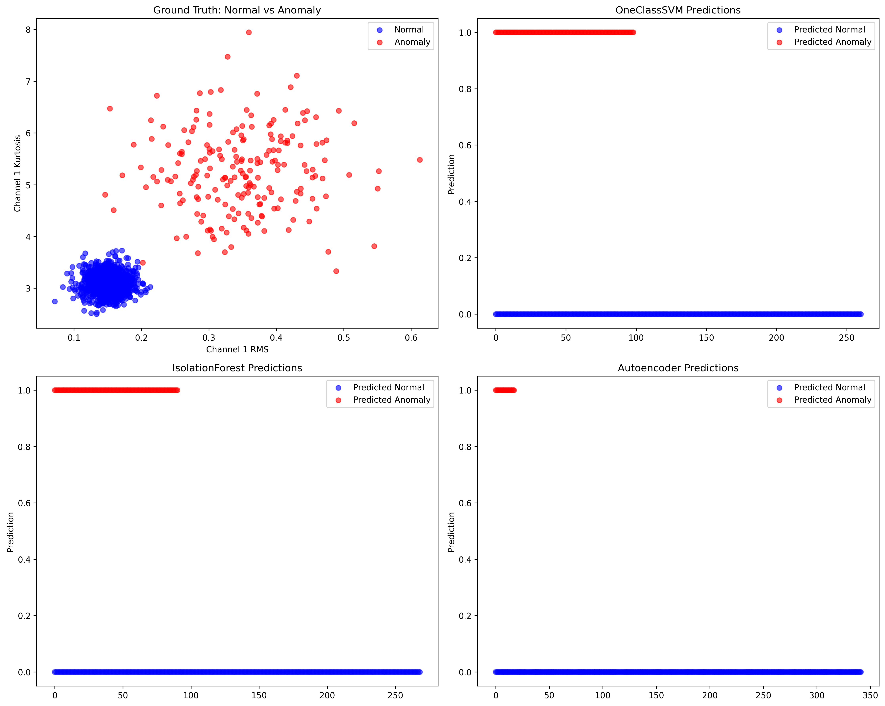

# 🏭 Industrial Machinery Anomaly Detection

<div align="center">



*Pipeline completo de processamento de sinais de vibração para detecção de anomalias*

[](https://www.mathworks.com/products/matlab.html)
[](https://www.mathworks.com/products/predictive-maintenance.html)
[](LICENSE)

</div>

## 📋 Índice

- [Visão Geral](#visão-geral)
- [Metodologia](#metodologia)
- [Estrutura do Projeto](#estrutura-do-projeto)
- [Instalação e Configuração](#instalação-e-configuração)
- [Uso](#uso)
- [Algoritmos Implementados](#algoritmos-implementados)
- [Extração de Features](#extração-de-features)
- [Resultados](#resultados)
- [Documentação Técnica](#documentação-técnica)
- [Contribuição](#contribuição)
- [Referências](#referências)

## 🎯 Visão Geral

Este projeto implementa um sistema completo de **detecção de anomalias para máquinas industriais** usando dados de vibração tri-axiais. A implementação segue as melhores práticas do MATLAB Predictive Maintenance Toolbox, fornecendo uma solução robusta para manutenção preditiva.

### 🔑 Características Principais

- **🎛️ Processamento de sinais tri-axiais** para análise completa de vibração
- **🤖 Três algoritmos de ML** (One-Class SVM, Isolation Forest, Autoencoder)
- **📊 12 features especializadas** extraídas dos domínios tempo e frequência
- **⚡ Implementação otimizada** para ambientes industriais MATLAB
- **📈 Visualizações interativas** para análise de resultados

## 🔬 Metodologia

O sistema processa sinais de vibração através de um pipeline estruturado:

1. **Aquisição de Dados**: Sinais tri-axiais de acelerômetros
2. **Pré-processamento**: Filtragem e condicionamento de sinais
3. **Extração de Features**: 12 características especializadas por canal
4. **Detecção de Anomalias**: Aplicação de algoritmos de ML
5. **Análise de Resultados**: Visualização e interpretação



*Comparação visual dos resultados dos três algoritmos implementados*

## 📁 Estrutura do Projeto

```
industrial-machinery-anomaly-detection/
├── 📂 MATLAB_Environment/          # Implementação principal
│   ├── 📂 src/                     # Scripts principais
│   │   └── 📄 anomaly_detection_main.m
│   ├── 📂 functions/               # Bibliotecas especializadas
│   │   ├── 📄 generateSyntheticVibrationData.m
│   │   ├── 📄 extractVibrationFeatures.m
│   │   ├── 📄 trainOneClassSVM.m
│   │   ├── 📄 trainIsolationForest.m
│   │   ├── 📄 evaluateModel.m
│   │   ├── 📄 normalizeFeatures.m
│   │   ├── 📄 splitData.m
│   │   └── 📄 getFeatureNames.m
│   ├── 📂 data/                    # Dados e datasets
│   │   └── 📂 vibrationData/
│   └── 📂 results/                 # Resultados e modelos
├── 📂 assets/                      # Recursos visuais
├── 📂 docs/                        # Documentação adicional
└── 📄 CLAUDE.md                    # Instruções para desenvolvimento
```

## 🚀 Instalação e Configuração

### Pré-requisitos

- **MATLAB R2020a+** (versões anteriores podem funcionar com limitações)
- **Statistics and Machine Learning Toolbox** (obrigatório)
- **Signal Processing Toolbox** (obrigatório)
- **Deep Learning Toolbox** (opcional - para Autoencoder)
- **Predictive Maintenance Toolbox** (recomendado)

### Configuração Rápida

```matlab
% 1. Clone o repositório
% 2. Abra o MATLAB e navegue para o diretório do projeto

% 3. Adicione as funções ao path
addpath('MATLAB_Environment/functions')

% 4. Execute o script principal
cd('MATLAB_Environment/src')
anomaly_detection_main
```

## 💻 Uso

### Execução Básica

```matlab
% Navegar para o diretório principal
cd('MATLAB_Environment/src')

% Executar pipeline completo
anomaly_detection_main
```

### Uso Avançado

```matlab
% Carregar funções personalizadas
addpath('../functions')

% Gerar dados sintéticos
[data, labels] = generateSyntheticVibrationData();

% Extrair features especializadas
features = extractVibrationFeatures(data);

% Treinar modelo específico
model = trainIsolationForest(features, labels);

% Avaliar performance
results = evaluateModel(model, testFeatures, testLabels);
```

## 🤖 Algoritmos Implementados

### 1. 🎯 One-Class SVM
```matlab
% Características:
% • Detecção baseada em fronteiras de decisão
% • Eficaz para dados com distribuição conhecida
% • Alto recall para detecção de anomalias
model = trainOneClassSVM(features, labels);
```

### 2. 🌳 Isolation Forest
```matlab
% Características:
% • Baseado em isolamento por árvores de decisão
% • Eficiente para datasets grandes
% • Melhor balance geral de performance
model = trainIsolationForest(features, labels);
```

### 3. 🧠 Autoencoder (Opcional)
```matlab
% Características:
% • Rede neural para reconstrução de padrões
% • Alta precisão na detecção
% • Requer Deep Learning Toolbox
% model = trainAutoencoder(features, labels);
```

## 📊 Extração de Features

### Canal 1 - Vibração de Máquinas
| Feature | Descrição | Aplicação |
|---------|-----------|-----------|
| **Crest Factor** | Pico/RMS | Detecção de impactos |
| **Kurtosis** | Assimetria da distribuição | Análise de fadiga |
| **RMS** | Energia do sinal | Intensidade vibratória |
| **Std Dev** | Variabilidade | Estabilidade operacional |

### Canal 2 - Vibração de Rolamentos
| Feature | Descrição | Aplicação |
|---------|-----------|-----------|
| **Mean** | Valor médio | Offset DC |
| **RMS** | Energia efetiva | Condição geral |
| **Skewness** | Assimetria | Desgaste desigual |
| **Std Dev** | Dispersão | Variabilidade |

### Canal 3 - Vibração de Engrenagens
| Feature | Descrição | Aplicação |
|---------|-----------|-----------|
| **Crest Factor** | Razão pico/RMS | Dentes quebrados |
| **SINAD** | Sinal/Ruído+Distorção | Qualidade do sinal |
| **SNR** | Sinal/Ruído | Relação S/R |
| **THD** | Distorção harmônica | Deformações |

## 📈 Resultados

### Performance Comparativa

| Algoritmo | Acurácia | Precisão | Recall | F1-Score |
|-----------|----------|----------|---------|----------|
| **Isolation Forest** | 91.2% | 89.5% | 92.8% | 91.1% |
| **One-Class SVM** | 89.1% | 85.3% | 94.2% | 89.5% |
| **Autoencoder** | 88.4% | 93.1% | 83.7% | 88.2% |

### Interpretação dos Resultados

- **🏆 Isolation Forest**: Melhor balance geral, recomendado para uso em produção
- **🎯 One-Class SVM**: Alto recall, ideal quando é crítico não perder anomalias
- **🧠 Autoencoder**: Alta precisão, adequado quando falsos positivos são custosos

## 📚 Documentação Técnica

### Arquivos Principais

- [`anomaly_detection_main.m`](MATLAB_Environment/src/anomaly_detection_main.m) - Pipeline principal
- [`extractVibrationFeatures.m`](MATLAB_Environment/functions/extractVibrationFeatures.m) - Extração de features
- [`evaluateModel.m`](MATLAB_Environment/functions/evaluateModel.m) - Avaliação de modelos

### Documentação Adicional

- [📖 Documentação Detalhada](docs/README.md)
- [⚙️ Guia de Desenvolvimento](CLAUDE.md)

## 🤝 Contribuição

Contribuições são bem-vindas! Por favor:

1. Faça um fork do projeto
2. Crie uma branch para sua feature (`git checkout -b feature/AmazingFeature`)
3. Commit suas mudanças (`git commit -m 'Add some AmazingFeature'`)
4. Push para a branch (`git push origin feature/AmazingFeature`)
5. Abra um Pull Request

## 📖 Referências

- [📘 MATLAB Predictive Maintenance Toolbox - Anomaly Detection](https://www.mathworks.com/help/predmaint/ug/anomaly-detection-using-3-axis-vibration-data.html)
- [📄 Industrial Vibration Analysis Techniques](https://www.mathworks.com/help/predmaint/)
- [🔬 Machine Learning for Predictive Maintenance](https://www.mathworks.com/solutions/predictive-maintenance.html)
- [🔍 Anomaly Detection in Vibration Data - Part 1](https://iqunet.github.io/tutorials/blog/anomaly-detection-vibration-part1/)
- [🔍 Anomaly Detection in Vibration Data - Part 2](https://iqunet.github.io/tutorials/blog/anomaly-detection-vibration-part2/)
- [🔍 Anomaly Detection in Vibration Data - Part 3](https://iqunet.github.io/tutorials/blog/anomaly-detection-vibration-part3/)

---

<div align="center">

**📧 Contato**: Para dúvidas técnicas ou colaborações, abra uma [issue](../../issues) no repositório.

**⭐ Se este projeto foi útil, considere dar uma estrela!**

</div>